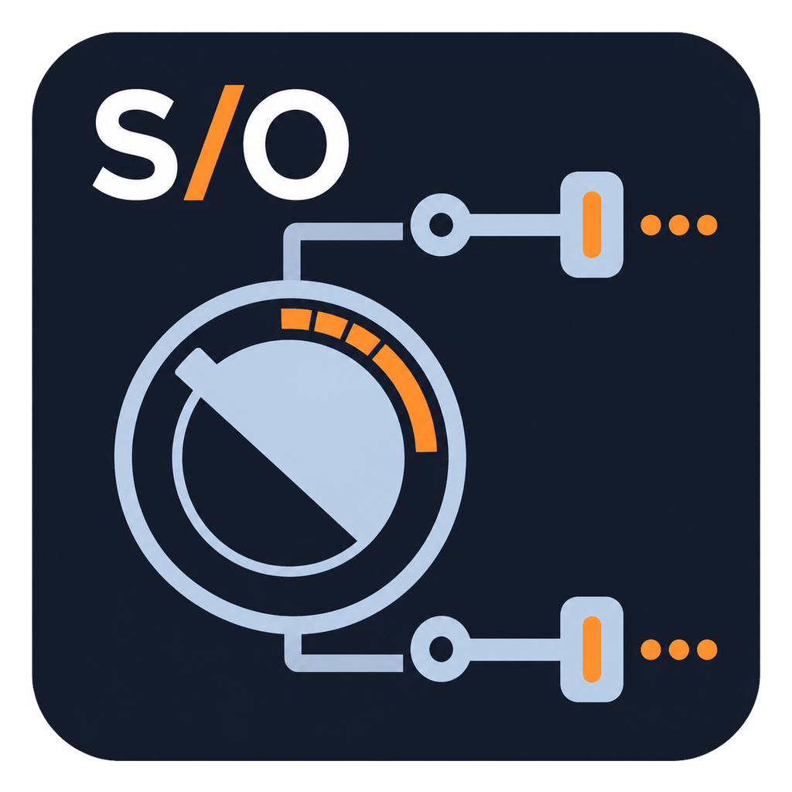

<a id="version-francaise"></a>

<p align="center">
  
</p>

<h1 align="center">Controller Studio for LiveProfessor</h1>

<p align="center">
  <strong>SiLeMI/O — By Mamat</strong><br>
  Contrôleurs MIDI, Plugin Studio et AutoMap réunis dans une seule application Windows.
</p>

<p align="center">
  <a href="https://github.com/Mamat79/Controller-Studio-for-LiveProfessor/releases/tag/v2026.4"></a>
  
  
</p>

<p align="center">
  <strong><a href="#english-version">English version below ↓</a></strong> · <a href="README_EN.md">Standalone English README</a>
</p>

## Dernière version (accès rapide)

**Version stable : [Controller Studio V.2026.4](https://github.com/Mamat79/Controller-Studio-for-LiveProfessor/releases/tag/v2026.4)**<br>
Téléchargement direct :

- [Installer Controller Studio pour Windows x64 (.exe)](https://github.com/Mamat79/Controller-Studio-for-LiveProfessor/releases/download/v2026.4/Controller-Studio-for-LiveProfessor-Setup-v2026.4.exe)
- [Version portable Windows x64 (.exe)](https://github.com/Mamat79/Controller-Studio-for-LiveProfessor/releases/download/v2026.4/Controller-Studio-for-LiveProfessor.exe)
- [Notice complète en français (.pdf)](https://github.com/Mamat79/Controller-Studio-for-LiveProfessor/releases/download/v2026.4/Controller-Studio-for-LiveProfessor-Notice-FR.pdf)
- [Full English manual (.pdf)](https://github.com/Mamat79/Controller-Studio-for-LiveProfessor/releases/download/v2026.4/Controller-Studio-for-LiveProfessor-Manual-EN.pdf)
- [Sommes de contrôle SHA-256](https://github.com/Mamat79/Controller-Studio-for-LiveProfessor/releases/download/v2026.4/SHA256SUMS.txt)

> **Version publique V.2026.4 pour Windows.** Controller Studio travaille sur une copie AutoMap et conserve le projet `.rack2` source intact.

## À quoi sert Controller Studio ?

Controller Studio transforme un contrôleur MIDI en surface de contrôle organisée pour les plug-ins de LiveProfessor. Dans la même application, vous pouvez choisir ou créer un contrôleur, produire son fichier LiveProfessor, analyser les plug-ins d’un projet et fabriquer une copie AutoMap prête à tester.

| Contrôle Live | Banque de contrôleurs | Plugin Studio | AutoMap |
|---|---|---|---|
| Pilote EC4 temps réel, banques, push, Shift, labels, valeurs et reconnexion | Profils prêts à exporter et éditeur de contrôleur | Vrais noms lus dans les plug-ins installés, récupération globale, priorités et cases individuelles | Choix des plug-ins et instances, UniBank ou FullBank, copie `.rack2` validée |

L’interface existe en français et en anglais, se réduit dans la zone de notification et place le journal temps réel dans une fenêtre séparée. Deux options indépendantes permettent de lancer Controller Studio avec Windows puis de connecter automatiquement le contrôleur sélectionné, sans devoir cliquer sur **Démarrer** après chaque redémarrage du serveur.

## Utilisation en trois étapes

1. Dans **Banque de contrôleurs**, choisissez votre matériel ou créez son profil, puis exportez le fichier `.ctrl2`.
2. Ajoutez ce contrôleur dans LiveProfessor et analysez votre projet `.rack2` avec **Plugin Studio**.
3. Cliquez sur le bouton bleu **AutoMap**, choisissez les plug-ins et paramètres utiles, puis ouvrez la nouvelle copie produite.

Controller Studio relit la copie générée avant de la proposer. Les affectations manuelles existantes restent prioritaires.

## AutoMap : la fonction centrale

AutoMap évite de lier définitivement chaque bouton MIDI à chaque paramètre de chaque plug-in. Controller Studio sépare les deux côtés du mapping :

- le **profil du contrôleur** décrit une seule fois les encodeurs, faders, boutons, banques et messages MIDI du matériel ;
- le **profil du plug-in** décrit une seule fois ses vrais paramètres, leur ordre, leur priorité et ceux qui doivent être inclus ;
- **AutoMap assemble les deux** dans les Controller Maps de LiveProfessor pour toutes les instances sélectionnées.

Ainsi, un contrôleur correctement déclaré peut servir avec tous les plug-ins préparés, et le profil d’un plug-in peut être réutilisé avec tous les contrôleurs disposant d’assez de commandes logiques. Changer de contrôleur ne signifie plus refaire manuellement le mapping de chaque plug-in ; ajouter une nouvelle instance d’un plug-in déjà reconnu ne signifie plus recommencer son MIDI Learn.

| Besoin | MIDI Learn direct dans LiveProfessor | Controller Studio + AutoMap |
|---|---|---|
| Premier réglage | Apprendre chaque commande physique, paramètre après paramètre | Décrire ou choisir le contrôleur une fois, puis laisser AutoMap créer les affectations |
| Plusieurs plug-ins | Refaire le mapping plug-in par plug-in | Traiter tous les plug-ins, ou seulement ceux cochés, en une opération |
| Plusieurs instances du même plug-in | Répéter le travail pour chaque instance | Réutiliser automatiquement le même ordre de paramètres sur les instances sélectionnées |
| Changer de contrôleur MIDI | Réapprendre les CC/Notes du nouveau matériel pour les plug-ins | Choisir ou créer son profil et exporter son `.ctrl2` ; les emplacements logiques AutoMap restent réutilisables |
| Choisir les paramètres utiles | Parcourir manuellement tous les paramètres exposés | Cocher/décocher, prioriser et nommer une fois dans Plugin Studio |
| Banques et plug-ins riches | Organisation manuelle, souvent différente d’un plug-in à l’autre | UniBank pour rester simple ou FullBank jusqu’à 99 commandes logiques |
| Labels et retours | Dépendent du mapping réalisé à la main | Noms courts, valeurs et retours Companion conservés dans le même ordre que les commandes |
| Sécurité du projet | Le mapping est effectué dans le projet ouvert | AutoMap crée et valide une nouvelle copie `.rack2` ; le projet source reste intact |

Les mappings manuels déjà présents ne sont pas écrasés : ils restent prioritaires, puis AutoMap complète uniquement les emplacements disponibles. Le résultat est un système réutilisable, où l’on entretient une banque de contrôleurs et une banque de plug-ins plutôt qu’une multitude de mappings **contrôleur × plug-in × instance**.

## Plugin Studio

Le fichier `.rack2` conserve l’ordre et les identifiants des paramètres, mais pas toujours leurs libellés humains. Plugin Studio retrouve ces informations directement dans les plug-ins VST3 installés, chacun dans un processus isolé. Le résultat n’est accepté que si son nombre de paramètres correspond exactement au projet LiveProfessor.

Après l’analyse du projet, **Récupérer tous les vrais noms** traite tous ses types de plug-ins en une seule opération, crée ou met à jour les profils locaux et sauvegarde automatiquement les versions précédentes.

Pour un plug-in donné :

1. ouvrez le profil du plug-in puis cliquez sur **Récupérer automatiquement les vrais noms** ;
2. utilisez **Tout cocher**, **Tout décocher** ou les cases individuelles ;
3. ajustez si nécessaire le libellé court, le type, le rôle ou la priorité, puis enregistrez le profil local.

Si un ancien format ou un plug-in particulier ne fournit pas directement un inventaire compatible, Controller Studio propose automatiquement le retour Companion/OSC de LiveProfessor comme seconde méthode.

La relation entre l’emplacement de la Controller Map et l’identifiant interne du paramètre est conservée afin d’éviter qu’un bon réglage reçoive le label d’un autre.

VST est une marque déposée de Steinberg Media Technologies GmbH. Les mentions tierces figurent dans [THIRD_PARTY_NOTICES.md](THIRD_PARTY_NOTICES.md).

## Banque de contrôleurs intégrée

V.2026.4 fournit 33 profils déclaratifs prêts à exporter et permet d’en fabriquer d’autres directement dans l’application :

- Akai Professional LPD8 MK2, MIDImix, APC Mini MK2, MPK Mini MK3, MPK Mini IV et MPK Mini Plus ;
- Arturia MiniLab 3, KeyLab Essential MK3 et BeatStep ;
- Faderfox EC4, PC4, UC4 et PC12 ;
- Behringer X-Touch, X-Touch Compact, X-Touch Mini et X-Touch One ;
- Korg nanoKONTROL2 (mode CC, réglages d’usine des potentiomètres et faders) ;
- Novation Launch Control XL MK2/XL 3, Launchkey MK3/MK4 et Launchpad X/Mini MK3 ;
- PreSonus FaderPort V2, 8 et 16 ;
- Solid State Logic UF1 et UF8 ;
- DJ TechTools MIDI Fighter Twister ;
- contrôleur MIDI générique à 16 commandes.

Les modes matériels et les sources constructeur utilisés sont regroupés dans [la documentation des profils](docs/CONTROLLER_PROFILE_SOURCES.md). La banque peut être mise à jour depuis l’application puis reste disponible hors ligne.

## Créer et partager un contrôleur

Cliquez sur **Créer un contrôleur…** pour partir d’un modèle de huit encodeurs, puis ajoutez, supprimez ou réordonnez encodeurs absolus ou relatifs, faders et boutons. Chaque commande accepte CC, Note, NRPN ou Pitch Bend, son canal et son numéro. **Apprendre le mouvement** et **Apprendre l’appui** capturent directement les messages reçus sur l’entrée MIDI choisie. Vous pouvez aussi **Modifier / dupliquer…** un modèle existant ou **Importer un profil…**.

**Enregistrer dans ma banque** valide le profil et le rend disponible hors ligne. **Enregistrer + créer .ctrl2** produit aussitôt le fichier LiveProfessor. Le remplacement d’un profil personnel conserve une sauvegarde de la version précédente. La page Live donne aussi accès à **Configurer / apprentissage MIDI…** pour le contrôleur actif ; le setup/groupe visible avec l’EC4 reste une fonction spécifique à ce matériel.

La fenêtre **Réglages** de la page Live retrouve les paramètres avancés d’EC4 Bridge : cadence de l’Overlay, durée d’affichage, rafraîchissement Companion et des labels, délai de confirmation LiveProfessor et affichage persistant. Ces temporisations sont disponibles pour tous les contrôleurs compatibles ; les outils setup/groupe et SysEx restent affichés uniquement pour l’EC4. Lorsque l’EC4 est connecté avant LiveProfessor, son écran affiche une attente localisée puis revient automatiquement aux paramètres dès que LiveProfessor répond.

Pour proposer un contrôleur à la bibliothèque commune :

1. créez ou sélectionnez le profil dans **Banque de contrôleurs** ;
2. cliquez sur **Proposer à la bibliothèque…** ;
3. Controller Studio valide le profil et place automatiquement tout son contenu dans le formulaire ;
4. GitHub s’ouvre pour identifier l’auteur et demander la confirmation finale ;
5. ajoutez si possible la documentation constructeur ou vos résultats d’essai puis envoyez la proposition.

Cette dernière confirmation reste volontairement chez GitHub : aucun mot de passe ni jeton d’accès n’est demandé ou conservé par Controller Studio.

La bibliothèque publique fait partie de ce dépôt dans [`library/`](library/). Elle contient uniquement des profils JSON déclaratifs, jamais de code téléchargé et exécuté.

## Fonctions principales

- création, import, export et validation de profils de contrôleurs ;
- génération de contrôleurs LiveProfessor Companion/OSC `.ctrl2` ;
- moteur EC4 complet hérité d’EC4 Bridge ;
- choix mémorisé du contrôleur et reconnexion MIDI/OSC ;
- labels et valeurs sur l’afficheur, banques, push et raccourcis ;
- analyse en lecture seule des plug-ins et Controller Maps ;
- sélection de tous les plug-ins, d’une instance ou d’un ensemble précis ;
- sélection et priorité de chaque paramètre dans Plugin Studio ;
- AutoMap UniBank et FullBank dans une nouvelle copie ;
- conservation des mappings manuels et apprentissages existants ;
- mise à jour vérifiée du logiciel et de la bibliothèque ;
- interface FR/EN, réduction dans la zone de notification et journal séparé ;
- notice PDF intégrée et soutien PayPal facultatif.

## Documentation

- [Notice complète en français](src/silemio_control_hub/manuals/Controller-Studio-for-LiveProfessor-Notice-FR.pdf)
- [Full English manual](src/silemio_control_hub/manuals/Controller-Studio-for-LiveProfessor-Manual-EN.pdf)
- [README in English](README_EN.md)
- [Sources des profils de contrôleurs](docs/CONTROLLER_PROFILE_SOURCES.md)
- [Historique des versions](CHANGELOG.md)

La notice correspondant à la langue de l’interface s’ouvre aussi depuis **Aide > Ouvrir la notice PDF**.

## Installation et mises à jour

L’installateur place Controller Studio dans le profil Windows de l’utilisateur et crée les raccourcis du Bureau et du menu Démarrer. Le logiciel se désinstalle ensuite depuis les applications Windows.

Le menu **Aide > Rechercher les mises à jour** consulte la dernière Release de ce dépôt, vérifie le téléchargement puis lance l’installateur. La bibliothèque de contrôleurs se met à jour séparément depuis le menu **Bibliothèque**.

## Développement et vérification

```powershell
python -m pip install -e .
python -m pytest -q
python -m silemio_control_hub profiles
python -m silemio_control_hub validate-profile "chemin\profil.json"
python -m silemio_control_hub export-liveprofessor-controller faderfox.ec4 ".\Faderfox-EC4.ctrl2"
python -m silemio_control_hub library-update
```

## Soutenir le projet

Controller Studio est développé et maintenu indépendamment. Toutes ses fonctions restent disponibles gratuitement.

- [Soutenir SiLeMI/O via PayPal](https://www.paypal.com/paypalme/MamatLeroy)
- le même lien et son QR code sont disponibles dans le menu **Aide**.

## Remerciements

Merci aux utilisateurs qui testent leurs contrôleurs, documentent les plans MIDI et enrichissent la bibliothèque publique.

LiveProfessor, Faderfox, Behringer, Novation, DJ TechTools et les autres noms cités restent les marques de leurs propriétaires respectifs. Controller Studio est un outil indépendant et n’est affilié à aucun de ces éditeurs ou fabricants.

---

**SiLeMI/O**<br>
**By Mamat**<br>
`-------[]--`

---

<a id="english-version"></a>

# English version

<p align="center">
  
</p>

<h1 align="center">Controller Studio for LiveProfessor</h1>

<p align="center">
  <strong>SiLeMI/O — By Mamat</strong><br>
  MIDI controllers, Plugin Studio and AutoMap in one Windows application.
</p>

<p align="center">
  <a href="https://github.com/Mamat79/Controller-Studio-for-LiveProfessor/releases/tag/v2026.4"></a>
  
  
</p>

## Latest version (quick access)

**Stable release: [Controller Studio V.2026.4](https://github.com/Mamat79/Controller-Studio-for-LiveProfessor/releases/tag/v2026.4)**<br>
Direct downloads:

- [Controller Studio installer for Windows x64 (.exe)](https://github.com/Mamat79/Controller-Studio-for-LiveProfessor/releases/download/v2026.4/Controller-Studio-for-LiveProfessor-Setup-v2026.4.exe)
- [Portable Windows x64 version (.exe)](https://github.com/Mamat79/Controller-Studio-for-LiveProfessor/releases/download/v2026.4/Controller-Studio-for-LiveProfessor.exe)
- [Full English manual (.pdf)](https://github.com/Mamat79/Controller-Studio-for-LiveProfessor/releases/download/v2026.4/Controller-Studio-for-LiveProfessor-Manual-EN.pdf)
- [Notice complète en français (.pdf)](https://github.com/Mamat79/Controller-Studio-for-LiveProfessor/releases/download/v2026.4/Controller-Studio-for-LiveProfessor-Notice-FR.pdf)
- [SHA-256 checksums](https://github.com/Mamat79/Controller-Studio-for-LiveProfessor/releases/download/v2026.4/SHA256SUMS.txt)

[Back to the French version ↑](#version-francaise)

> **Public V.2026.4 Windows release.** Controller Studio always works on a new AutoMap copy and keeps the source `.rack2` project untouched.

## What does Controller Studio do?

Controller Studio turns a MIDI controller into an organized control surface for LiveProfessor plug-ins. In one application, you can select or build a controller, create its LiveProfessor file, analyze project plug-ins and produce an AutoMap copy ready for testing.

| Live control | Controller bank | Plugin Studio | AutoMap |
|---|---|---|---|
| Real-time EC4 driver, banks, push, Shift, labels, values and reconnection | Ready-to-export profiles and a controller editor | Real names read from installed plug-ins, batch retrieval, priorities and individual checkboxes | Plug-in and instance selection, UniBank or FullBank, validated `.rack2` copy |

The interface is available in French and English, minimizes to the notification area and keeps the real-time log in a separate window. Two independent options can launch Controller Studio with Windows and then connect the selected controller automatically, so a server restart no longer requires clicking **Start**.

## Three-step workflow

1. In **Controller bank**, select your hardware or create its profile, then export the `.ctrl2` file.
2. Add that controller to LiveProfessor and analyze your `.rack2` project with **Plugin Studio**.
3. Click the blue **AutoMap** button, choose the useful plug-ins and parameters, then open the new copy.

Controller Studio reloads the generated copy before presenting it. Existing manual assignments remain authoritative.

## AutoMap: the central feature

AutoMap avoids permanently tying every physical MIDI control to every parameter of every plug-in. Controller Studio separates both sides of the mapping:

- the **controller profile** describes the hardware's encoders, faders, buttons, banks and MIDI messages once;
- the **plug-in profile** describes its real parameters, order, priority and inclusion choices once;
- **AutoMap combines both** in LiveProfessor Controller Maps for every selected instance.

As a result, one properly described controller can work with every prepared plug-in, while one plug-in profile can be reused with every controller that provides enough logical controls. Changing controller no longer means manually remapping every plug-in; adding another instance of an already recognized plug-in no longer means repeating its MIDI Learn setup.

| Need | Direct MIDI Learn in LiveProfessor | Controller Studio + AutoMap |
|---|---|---|
| Initial setup | Learn every physical control, one parameter at a time | Describe or select the controller once, then let AutoMap create the assignments |
| Several plug-ins | Repeat the mapping plug-in by plug-in | Process every plug-in, or only the checked ones, in one operation |
| Several instances of one plug-in | Repeat the work for every instance | Automatically reuse the same parameter order on all selected instances |
| Change MIDI controller | Relearn the new hardware's CC/Note messages for the plug-ins | Select or build its profile and export its `.ctrl2`; the logical AutoMap slots remain reusable |
| Select useful parameters | Manually browse every exposed parameter | Select, exclude, prioritize and name them once in Plugin Studio |
| Banks and parameter-rich plug-ins | Manual organization that often differs between plug-ins | UniBank for a simple layout or FullBank for up to 99 logical controls |
| Labels and feedback | Depend on the mappings built by hand | Short names, values and Companion feedback follow the same order as the controls |
| Project safety | Mapping is performed inside the open project | AutoMap creates and validates a new `.rack2` copy; the source project remains untouched |

Existing manual mappings are never overwritten: they remain authoritative and AutoMap fills only the available slots. The result is a reusable system that maintains one controller bank and one plug-in bank instead of many **controller × plug-in × instance** mappings.

## Plugin Studio

A `.rack2` file stores parameter order and identifiers, but not always their human-readable labels. Plugin Studio retrieves that data directly from installed VST3 plug-ins, each in an isolated process. A result is accepted only when its parameter count exactly matches the LiveProfessor project.

After project analysis, **Retrieve all real names** processes every plug-in type in one operation, creates or updates local profiles, and automatically backs up previous versions.

For one plug-in:

1. open the plug-in profile and click **Automatically retrieve real names**;
2. use **Select all**, **Select none** or the individual checkboxes;
3. adjust the short label, kind, technical role or priority if needed, then save the local profile.

If an older format or a particular plug-in does not provide a directly compatible inventory, Controller Studio automatically offers LiveProfessor Companion/OSC feedback as a second method.

The link between each Controller Map slot and the internal parameter identifier is preserved, preventing a correct control from receiving another parameter’s label.

VST is a registered trademark of Steinberg Media Technologies GmbH. Third-party notices are listed in [THIRD_PARTY_NOTICES.md](THIRD_PARTY_NOTICES.md).

## Built-in controller bank

V.2026.4 includes 33 declarative profiles ready to export and can build more directly in the application:

- Akai Professional LPD8 MK2, MIDImix, APC Mini MK2, MPK Mini MK3, MPK Mini IV, and MPK Mini Plus;
- Arturia MiniLab 3, KeyLab Essential MK3, and BeatStep;
- Faderfox EC4, PC4, UC4 and PC12;
- Behringer X-Touch, X-Touch Compact, X-Touch Mini, and X-Touch One;
- Korg nanoKONTROL2 (CC mode, factory knob and fader assignments);
- Novation Launch Control XL MK2/XL 3, Launchkey MK3/MK4, and Launchpad X/Mini MK3;
- PreSonus FaderPort V2, 8, and 16;
- Solid State Logic UF1 and UF8;
- DJ TechTools MIDI Fighter Twister;
- generic 16-control MIDI controller.

Hardware modes and manufacturer references are collected in the [controller profile documentation](docs/CONTROLLER_PROFILE_SOURCES.md). The bank can be updated from the application and then remains available offline.

## Build and share a controller

Click **Create a controller…** to start with eight encoders, then add, remove, or reorder absolute or relative encoders, faders, and buttons. Every control accepts CC, Note, NRPN, or Pitch Bend, its channel, and its number. **Learn movement** and **Learn push** capture messages directly from the chosen MIDI input. You can also **Edit / duplicate…** an existing model or **Import a profile…**.

**Save to my bank** validates the profile and makes it available offline. **Save + create .ctrl2** immediately produces the LiveProfessor file. Replacing a personal profile keeps a backup of the previous version. The Live page also provides **Configure / MIDI Learn…** for the active controller; the setup/group section shown with the EC4 remains hardware-specific.

The Live page **Settings** window restores EC4 Bridge’s advanced controls: Overlay update rate and duration, Companion and label refresh delays, LiveProfessor feedback timeout, and persistent display. These timings are available to every compatible controller; setup/group and SysEx tools remain EC4-only. If the EC4 connects before LiveProfessor, its screen shows a localized waiting message and automatically restores parameter feedback as soon as LiveProfessor responds.

To submit a controller to the shared library:

1. create or select its profile in **Controller bank**;
2. click **Submit to the library…**;
3. Controller Studio validates the profile and automatically inserts all its content into the form;
4. GitHub opens to identify the author and request final confirmation;
5. add manufacturer documentation or hardware test results when possible, then submit.

That final confirmation deliberately stays with GitHub: Controller Studio never asks for or stores a password or access token.

The public library lives in this repository under [`library/`](library/). It contains declarative JSON profiles only—never downloaded executable code.

## Main features

- create, import, export and validate controller profiles;
- generate LiveProfessor Companion/OSC `.ctrl2` controllers;
- complete EC4 engine inherited from EC4 Bridge;
- remembered controller selection and MIDI/OSC reconnection;
- display labels and values, banks, push and shortcuts;
- read-only plug-in and Controller Map analysis;
- select all plug-ins, one instance or any precise subset;
- per-parameter selection and priority in Plugin Studio;
- UniBank and FullBank AutoMap in a new copy;
- preserve manual mappings and existing learned assignments;
- verified application and controller-library updates;
- FR/EN interface, notification-area mode and separate log window;
- built-in PDF manual and optional PayPal support.

## Documentation

- [Full English manual](src/silemio_control_hub/manuals/Controller-Studio-for-LiveProfessor-Manual-EN.pdf)
- [Notice complète en français](src/silemio_control_hub/manuals/Controller-Studio-for-LiveProfessor-Notice-FR.pdf)
- [README en français](README.md)
- [Controller profile sources](docs/CONTROLLER_PROFILE_SOURCES.md)
- [Release history](CHANGELOG.md)

The manual matching the interface language is also available from **Help > Open PDF manual**.

## Installation and updates

The installer places Controller Studio in the user’s Windows profile and creates Desktop and Start menu shortcuts. It can then be removed from Windows Apps.

**Help > Check for updates** queries the latest Release in this repository, verifies the download and starts the installer. The controller library is updated separately from the **Library** menu.

## Development and verification

```powershell
python -m pip install -e .
python -m pytest -q
python -m silemio_control_hub profiles
python -m silemio_control_hub validate-profile "path\profile.json"
python -m silemio_control_hub export-liveprofessor-controller faderfox.ec4 ".\Faderfox-EC4.ctrl2"
python -m silemio_control_hub library-update
```

## Support the project

Controller Studio is independently developed and maintained. Every feature remains available free of charge.

- [Support SiLeMI/O through PayPal](https://www.paypal.com/paypalme/MamatLeroy)
- the same link and QR code are available from the **Help** menu.

## Thanks

Thank you to everyone who tests controllers, documents MIDI layouts and expands the public library.

LiveProfessor, Faderfox, Behringer, Novation, DJ TechTools and all other cited names remain trademarks of their respective owners. Controller Studio is an independent tool and is not affiliated with those publishers or manufacturers.

---

**SiLeMI/O**<br>
**By Mamat**<br>
`-------[]--`
